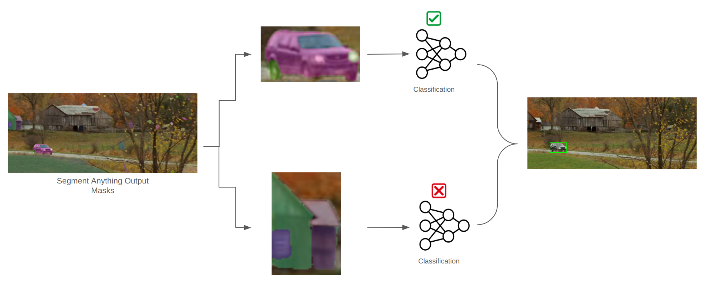

# Setup and Run Instructions

Run the following commands to setup the environment
- ```./run.sh```
- ```python3 -m venv test_env```
- ```pip3 install -r requirements.txt```
- ```python3 -m pip install 'git+https://github.com/facebookresearch/segment-anything.git'```

To do the final inference, run the below script:
- ```python3 main.py```


# Introduction

Building a generalizable and scalable tracker


# Approach

To achieve a generalized and scalable model the follow high level requirements were formulated:

1. The tracker's inference time **should not be affected by larger data** (100x the test set)
2. The tracker must **work equally well for unseen data** and must improve with more annotated data
3. The tracker should be **capable of handling occlusions**, motions blurs, and weather effects

## 1. Addressing Scalability

I did some literature review on trackers in deep learning such as:
- [Deep Sort](https://arxiv.org/pdf/1703.07402.pdf)
- [RAFT](https://arxiv.org/pdf/2003.12039.pdf)
- [Tracking Everything Everywhere All at Once](https://arxiv.org/pdf/2306.05422.pdf)

'Tracking Everything Everywhere All at Once' seems to have the best results, but just like
RAFT, it's built for dense tracking which does not seem to be the requirement in this
problem.

Further both perform tracking by optimizing a canonical 3D voloume (in a NERF like representation).
While this may be suitable for accurate dense tracking, I was not sure about the scalability to
large geometry and large spaces.

On the otherhand, Deep Sort, which is a Kalman Filter based estimator, is viable due to it's
speed. However, it does require a well trained object detector to operate. This was addressed
below.

## 2. Addressing Unseen Data

### 2.1. Choosing a Zero Shot Detector

Previously we saw that Deep Sort would work well if we had an object detector. However,
object detectors like [YOLO](https://arxiv.org/pdf/1506.02640.pdf) and it's newer variants
like [YoloV8](https://docs.ultralytics.com/modes/track/) are usually trained on huge amounts
(over a million images) of data to give tight boxes.

To build a generic tracker without large amounts of annotated data, we would need a general
purpose detector. I evaluated two options for this:

1. Zero Shot Detectors - eg. [OWL-ViT, OWLv2](https://huggingface.co/docs/transformers/en/tasks/zero_shot_object_detection)
2. [Segment Anything](https://segment-anything.com/)

Zero shot detectors can also be conditioned on query images which made them a first choice. I
have attached a few images taken directly from the Huggingface tutorial below:


However, after few trials, I found the detection to be inconsistent (and
surprisingly **not** scale invariant for our test data)

Hence, I moved on to using Segment Anything, which was much more stable at the cost of longer
runtime. For scalability, finetuning the zero shot detector would be a better option, but I
chose to use Segment Anything for this proof of concept.


### 2.2. Filtering the Zero Shot Detections

- If running inference on non-annotated data, we will not get predicted labels from the zero-shot
detector's bounding boxes. Hence, these will need to be filtered.
- **To build a filter on only 100 images of the video sequence, where only one side of the car
is visible, would highly overfit any classification network.**
- Hence, to build a common pipeline which can finetune a classifier on any unseen data, I needed
  more views of the object of interest.

**I utilized a pre-trianed diffusion model which builds a 3D geometry** by optimizing a Signed Distance Function (SDFs) called
[One-2-3-45](https://arxiv.org/pdf/2306.16928.pdf). I had to slightly hack this pipeline to
output ~5600 views instead of a discrete 4 views of the object.

### 2.3. Building and Training the Classifier

Finally, I tried using both a pretrained Resnet18 (finetuning just the fully-connected layer)
and also my own implementation of ConvNext (which has fewer parameters than what was available online).

I chose to use Resnet18 in the final pipeline due to it's better performance (mostly due to
it's pre-training).

### 2.4. Integrating the Pipeline

Finally, the **end-to-end pipeline relied on bounding box predictions by segment anything and
filtering using a finetuned classifier.**

#### Pipeline Step 1


#### Pipeline Step 2


#### Pipeline Step 3 : Inference


# Potential Improvements

#### Detector
- Segment anything is used here as a zero-shot detector. However, it's slow and requires a
classifier to filter detections.
- A **potential improvement could be to finetune an existing zero-shot detector** like OWL-ViT
  which could yield runtime improvements and removes the need for a classifier.

#### Classifier
- The classifier can be improved with better augmentation (currently the generated views of the car only have white background)
- I used the SUN dataset with outdoor images (where no cars are present) as negative labels when training the classifier.
  However, for other objects of interest where it may be difficult to find negative labels, methods like [mixup](https://arxiv.org/pdf/1710.09412v2.pdf)
  can be used to build the dataset.
- Train the classifier with images at different scales. Currently small segments manage to pass through the classifier as shown below:
  

#### Tracker
- Use an updated tracker like Byte-Sort or Bot-Sort for better tracking

# Other Approaches Considered

I also considered the following:
1. Using the generated multiple views (5600 views) of the object of interest to fintune an existing object detection network like DeTR
2. Running the zero shot detector over images at different scales

While both the above options were viable, they had lesser chances of success in the short timeframe

# Appendix

## Installing Pytorch3D

This is a bit tricky, I do the following in a ipynb
```python
import os
import sys
import torch
need_pytorch3d=False
try:
    import pytorch3d
except ModuleNotFoundError:
    need_pytorch3d=True
if need_pytorch3d:
    if torch.__version__.startswith("2.1.") and sys.platform.startswith("linux"):
        # We try to install PyTorch3D via a released wheel.
        pyt_version_str=torch.__version__.split("+")[0].replace(".", "")
        version_str="".join([
            f"py3{sys.version_info.minor}_cu",
            torch.version.cuda.replace(".",""),
            f"_pyt{pyt_version_str}"
        ])
        !pip install fvcore iopath
        !pip install --no-index --no-cache-dir pytorch3d -f https://dl.fbaipublicfiles.com/pytorch3d/packaging/wheels/{version_str}/download.html
    else:
        # We try to install PyTorch3D from source.
        !pip install 'git+https://github.com/facebookresearch/pytorch3d.git@stable'
```
